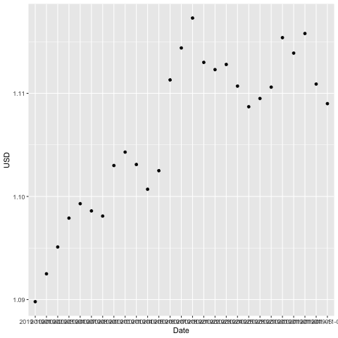

HW1
================
Josef Hemmingsson
November 6, 2019

# \# 1. Create a subdirectory HW1 in your Homework directory.

# Done, as where this document is located

setwd(“/Homework") dir.create("HW1")
setwd("/Homework/HW1”)

# \# 2. Write an R Markdown document called HW1.Rmd in HW1, this should contain

# \# \# the document option output: github\_document in the header,

# Done, see header in the source code

# Install packages

install.packages(“rlang”) install.packages(“ggplot2”)
install.packages(“lubridate”) install.packages(“rmarkdown”)
install.packages(“knitr”) library(rlang) library(ggplot2)
library(lubridate) library(rmarkdown)
library(knitr)

# \# \# a brief description of your past experiences, if any, of using R, RStudio, R Markdown, Git, Github, ggplot2 and dplyr,;

# Limited experience.

# Coded in R a few years ago when participating in a fraud detection project for an insurance company

# Mainly coded in SAS and VBA in the last 10 years

# \# \# a plot, using ggplot, of some aspect of a data-set. The data-set should be found on the web (i.e. not one that is preloaded in R or in some package) and you should document any steps taken in retrieving the data.

# Define the URL for the data (URL to the ZIP file online)

url \<-
“<https://www.ecb.europa.eu/stats/eurofxref/eurofxref-hist.zip>”

# Define where the filename for the downloaded file (in the working directory)

destfile \<- “eurofxref-hist.zip”

# Download the file

download.file(url, destfile)

# Unzip the file…

unzip(“eurofxref-hist.zip”)

# …and we will then have a CSV file in the directory

# Import the CSV file to a dataset in R

eur \<- read.csv(“eurofxref-hist.csv”)

# Filter only dates from this year

eur2 \<- subset(eur,substr(Date,1,4)\>=year(now()))

# Filter only dates from this month (and previous)

eur3 \<- subset(eur2,month(Date)\>=month(now())-1)

# Plot the data using ggplot

ggplot(eur3, aes(y=USD, x=Date)) +
geom\_point()

dev.copy(png,‘Rplot.png’)

dev.off()

# \# \# End the document with a code chunk containing sessionInfo() (see end of this document), informing the reader what versions of R and packages you are using.

sessionInfo()

## R version 3.6.1 (2019-07-05)

## Platform: x86\_64-apple-darwin15.6.0 (64-bit)

## Running under: macOS Catalina 10.15

## Matrix products: default

## BLAS: /System/Library/Frameworks/Accelerate.framework/Versions/A/Frameworks/vecLib.framework/Versions/A/libBLAS.dylib

## LAPACK: /Library/Frameworks/R.framework/Versions/3.6/Resources/lib/libRlapack.dylib

## locale:

## \[1\] en\_US.UTF-8/en\_US.UTF-8/en\_US.UTF-8/C/en\_US.UTF-8/en\_US.UTF-8

## attached base packages:

## \[1\] stats graphics grDevices utils datasets methods base

## loaded via a namespace (and not attached):

## \[1\] compiler\_3.6.1 tools\_3.6.1 packrat\_0.5.0
